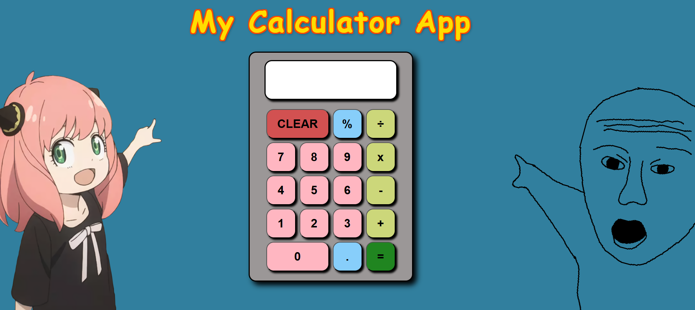

## ⛅ Calculator App Project:

- A fun and interactive calculator app with a unique anime-inspired design! Perform basic arithmetic operations with a stylish UI.

## 😧 Features:
- ➕ Basic Arithmetic Operations: Addition, subtraction, multiplication, and division.
- 🎨 Unique Themed UI: Features custom-designed buttons and an anime-inspired background.
- 🖥 Responsive Design: Works seamlessly on desktop and mobile devices.
- 🔄 Clear Functionality: Reset calculations easily with the CLEAR button.

##  📸 Screenshot: 
- 

##  🌍 LIVE DEMO:
- Try it Out: https://chrisw0987.github.io/calculator-app/

## 🛠 Tech Stack:
- **Frontend:** React.js, Vite
- **Styling:** CSS, Animations
- **Tools**: GitHub, VS Code


## 📦 Installation:
1. Clone the repository:
   ```bash
   git clone https://chrisw0987.github.io/calculator-app/
2. cd calculator-app
3. npm install
4. npm run dev